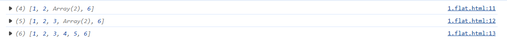
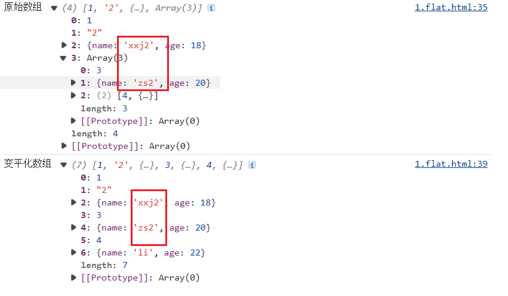

### Array.prototype.flat()

`flat() `方法创建一个新的数组，并根据指定深度递归地将所有子数组元素拼接到新的数组中。

### 参数

`depth(可选)：`提取嵌套数组的结构深度，默认值为 `1`。

### 返回值

一个新的数组，扁平化之后的数组。

##### 示例

```javascript
<script>
  const arr = [1, [2, [3, [4, 5]]], 6]; 
  console.log(arr.flat()); //展开1层
  console.log(arr.flat(2)); //展开2层 
  console.log(arr.flat(Infinity)); //展开全部
</script>
```


### 其他
`flat()`属于复制方法，不改变原始数组，返回的是浅拷贝
#### 示例
数组中包含对象类型

```javascript
      const arr2 = [
        1,
        "2",
        {name:"xxj",age:18},
        [
          3,
          {name:"zs",age:20},
          [
            4,
            {name:'li',age:22}
          ]
        ]
      ]
      let res1 = arr2.flat() //展开1层
      console.log(res1)
      let res2 = arr.flat(Infinity) //展开全部
      console.log(res2)
```


```javascript
      // 浅拷贝测试
      console.log("原始数组",arr2)
      // 修改原始数组
      arr2[2].name='xxj2'
      arr2[3][1].name = 'zs2'
      console.log("变平化数组",res2)
```
修改原始数组中的对象属性，扁平化后的数组也变化了，说明是浅拷贝
